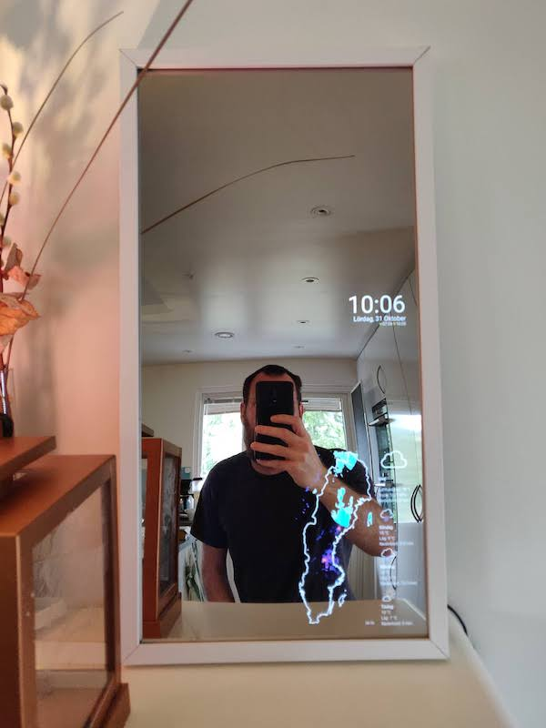
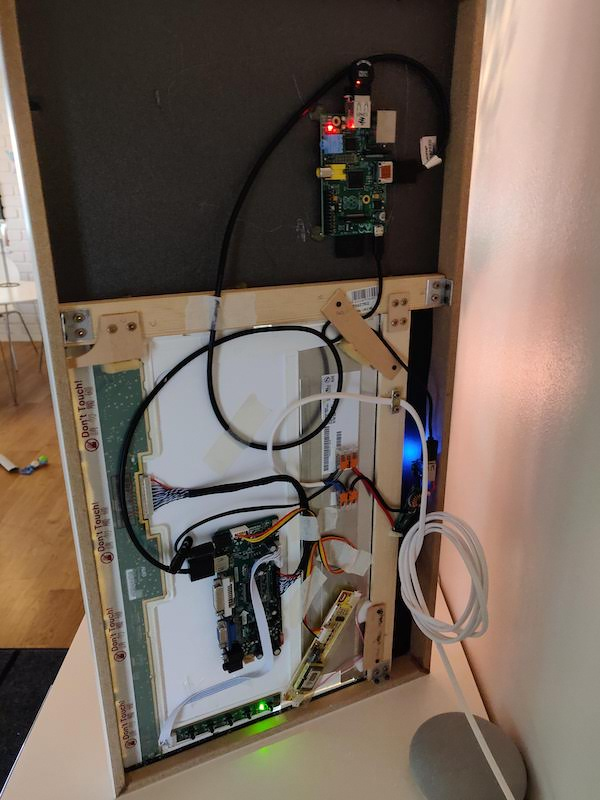

# howto-magic-mirror

This was written 2021. A lot has changed since then. See the [new version](the-new-version.md).

Building a magic mirror with home assistant as backend. This mirror can off course be built and then used with
[MagicMirror](https://magicmirror.builders/) or other software.



## The "Magic" mirror
Building the magic mirror requires some hardware, software and other things. 

### Hardware you will need
 * A picture frame
 * A two-way mirror or "spy" mirror
 * LCD panel from old laptop, or a new panel
 * Black paper as large as the mirror
 * Driver for said lcd panel (available at ebay, search for "lcd driver YOUR-PANELS-PART-NR")
 * Raspberry pi (or other small computer)
 * WiFi dongle for Raspberry Pi if the Pi has none
 * Micro USB/USB-C cable for the Pi
 * HDMI cable
 * Something that makes 5V from 12V, a usb charger for cars for example (the amperage is important, the higher the better)
 * DC plug for the LCD-driver if required
 * Wiring
 * Scrap wood, glue, screws, tape and stuff, or a 3D-printer to print parts
 * A computer or NAS or something else that can serve a web page on your local network
 
### Software you will need
 * Raspbian operating system for the Pi
 * Nginx/Apache or some other web server for hosting the web app
 * Chromium
 * X server
 * The React application, a good place to start is [NextJS](https://nextjs.org/)
 * [home-assistant-js-websocket](https://github.com/home-assistant/home-assistant-js-websocket)
 
### Other things you will need
 * Time, lots of time
 * Money, depending on quality of the build

There are many ways to build a magic mirror (google "how to build a magic mirror"). You could have the lcd panel cover
the whole back of the mirror or have a bigger mirror than the panel.

There are ready-to-install modular software solutions for the actual application, see [Magic Mirror 2](https://magicmirror.builders/).

I am already running Home Assistant in my house, so I already have a backend that integrates easy with other 
systems/vendors/weather etcetera. Also, I'm a frontend developer, so I prefer Javascript instead of Python. I wanted a 
magic mirror that only loads a web page/application that I could easily customise as I wanted.

Having a magic mirror that only loads a webpage also brings other options;
[HADashboard from AppDaemon](https://appdaemon.readthedocs.io/en/latest/DASHBOARD_INSTALL.html) but was not customisable 
enough for me.

## Building the mirror
First one has to decide how big the mirror should be. That depends on the size of the mirror/glass and the panel.

The easiest way would probably be to have as large a panel as possible and equal size glass.

### Mirror/glass/acrylic
You have three options:
 * Cheapest and simplest is buying an [acrylic two-way mirror fom Amazon](https://www.amazon.com/dp/B01G4MQ5OW). Although this type scratches extremely easy! I mean really easy. If you sneeze in the same room it will get scratches.
 * An adhesive foil to be attached on the back of a glass (which is really hard to do)
 * Real two-way glass mirror
   * This one from [Amazon](https://www.amazon.com/Two-Way-Glass-Mirror-Surveillance/dp/B01MSAZ3PN)
   * Or preferably a SAINT-GOBAIN GLASS MIRASTAR available at Swedish reseller [Glasbolaget](https://glasbolaget.se/glas-speglar/spionspegel/)

## First version (2019)

I had already bought a 30,5x61 cm (12"x24") acrylic mirror on Amazon.

Since my mirror is way bigger than my 15,6" panel I bought a piece of black paper as large as the mirror and made a 
cut-out for the panel. If this is not done you can see through the part of the mirror which does not have the panel 
behind. One drawback is that in dark rooms the panel is visible due to it being slightly lit (second version fixes this
problem).



### Frame
The frame could be built from scratch using L profile wood but in Sweden this is crazy expensive.

I bought a picture frame from Ikea ([Lomviken](https://www.ikea.com/se/sv/p/lomviken-ram-vit-40419524/)) that I chopped
up and reassembled to a smaller frame. 

### Home assistant as backend
Getting data from Home Assistant is fairly easy. Home Assistant have an api and there is a library for
[communicating with that api over web socket](https://github.com/home-assistant/home-assistant-js-websocket).

All I needed to do was to write a React app that connects to Home Assistant and subscribes to all entities and events
(it would be as easy to send service commands as well i.e. to control Home Assistant from the magic mirror, if the 
panel had touch or other input).

### Kiosk mode
Kiosk mode is a mode where a computer just boots into one application, and the user is unable to open other applications. 
This is exactly what we need Chromium to do.

We want the Pi to just boot and fetch a web page from a predefined URL (your web server, on your local network, that 
serves the React application)

#### Setting up kiosk mode on the Pi
First [install raspbian on your pi](https://www.raspberrypi.org/documentation/installation/installing-images/).

To set up kiosk mode, follow [these instructions](https://die-antwort.eu/techblog/2017-12-setup-raspberry-pi-for-kiosk-mode/).

If the panel is rotated, the HDMI output must be rotated as well. My panel is rotated 270 degrees clockwise. 
In `/boot/config.txt`:

```
display_hdmi_rotate=3
```

And the line `dtoverlay=vc4-fkms-v3d` must be commented out.

See the docs for video options at [raspberrypi.org](https://www.raspberrypi.com/documentation/computers/configuration.html)

Chromium has a feature to tell the user about updates. To disable that popup use the flag "check-for-update-interval".

```
chromium-browser --disable-infobars --disable-component-update --check-for-update-interval=31536000 --kiosk 'http://URL_TO_YOUR_WEB_SERVER'
```

At this point the magic mirror should work and one can either use HADashboard or as I did write my own web page/web application.

### Conclusion
After running the mirror for almost five years (it did fell one time, so I had to replace the panel) I can't live without
it. The frame have some cracks ant I have always been annoyed with the light from the LCD coming through the mirror so you
can see exactly where the screen is behind the mirror.

Also, the mirror has scratches... 

So. What about an OLED screen? And a scratch-free mirror? And a faster Pi? And a frame that needs no modification?

I'm building the [new version](the-new-version.md).

