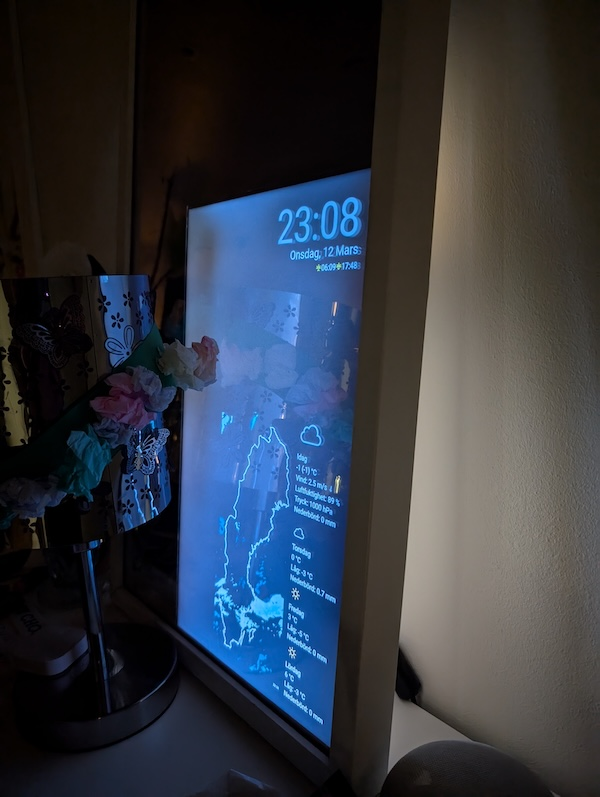
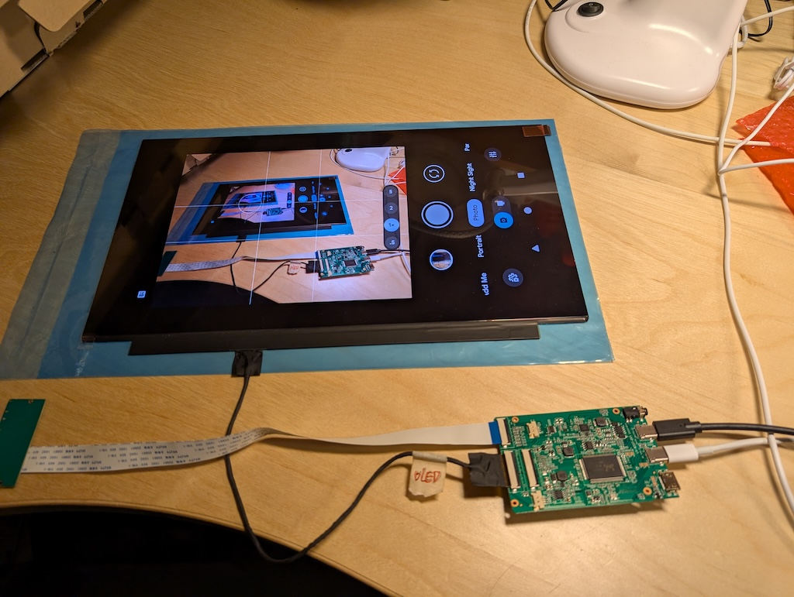
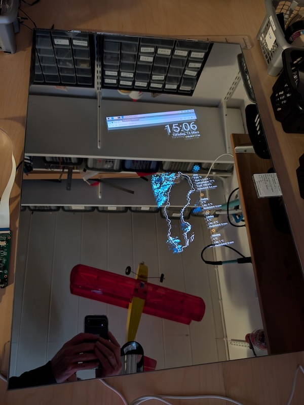

# How to build a Magic Mirror, second version

Since building my [first Magic Mirror](README.md) a lot has changed.

The first build used an acrylic "mirror" and an LCD panel from an old laptop (actually two, since the first one got
incinerated when the mirror hit the floor). Anyway, the first version had some flaws:
* The acrylic mirror easily got scratches and the surface is not perfectly flat which gives funny effects
* The frame was built by modifying an IKEA frame which never looked very good.
* The Raspberry Pi that was used was old and slow

## Time to build a new version

My prerequisites are still to use Home Assistant as backend and a web page that is loaded in "kiosk mode" in Chromium
on the magic mirror.

This journey actually started a couple of years ago; I actually bought the Oled screen 2023. But all the oled driver kits
I bought failed (some actually started smoking).

## The most awesome magic mirror setup ever

So. The hardware... Lessons learned from the [first version](README.md) was, in short, LCD panels are visible through 
the mirror even when the picture is black. And using acrylic mirrors are bad due to scratches and that the surface is
not perfectly flat.



Let's fix that with an OLED panel and some real glass!

## The parts

So after trying four or five "OLED panel drivers" that all did not work I finally found a working one! And the project
could continue after nearly four years on the shelf.

### The part list

This is what the Magic Mirror will consist of:

| Part                                         | Link                                                                                  | Cost           |
|----------------------------------------------|---------------------------------------------------------------------------------------|----------------|
| Samsung atna56yx03 OLED panel                | [Aliexpress](https://www.aliexpress.com/item/1005004725887223.html)                   | approx. 180 USD |
| Oled panel driver | [Aliexpress](https://www.aliexpress.com/item/1005006499232516.html) | approx 40 USD |
| SAINT-GOBAIN GLASS [MIRASTAR](https://www.saint-gobain-glass.com/MIRASTAR-MIRASTAR-REFLECT) 500x700x6 mm | [Glasbolaget (Sweden)](https://glasbolaget.se/k/spegelglas/) | approx. 110 USD |
| Frame, Ribba from Ikea                       | No longer available? But any frame should do                                          | approx. 20 USD |
| Raspberry Pi 4 Model B                       | [Raspberry 4](https://www.raspberrypi.com/products/raspberry-pi-4-model-b/)           | 50-70 USD |
| Car charger                                  | [Amazon](https://www.amazon.se/dp/B08VJ2VH2J)                                         | 14 USD |
| USB-C cable(s)                               | [Amazon](https://www.amazon.se/dp/B0BF4ZSFT1)                                         | 9 USD |
| USB A->C cable(s)                            | [Amazon](https://www.amazon.se/dp/B0B9XY39FF)                                         | 8 USD |
| HDMI-cable                                   | [Amazon](https://www.amazon.com/Seadream-Micro-Connector-Adapter-Cable/dp/B08BFZFT7R/) | 7 USD |

And then a 12V power supply and a cable with a DC connector or something similar. Maybe a fan or a heat sink. Or both.

Alternately there are portable monitors that can be used: https://www.aliexpress.com/item/1005007915529155.html and https://www.aliexpress.com/item/1005006782948672.html

## The build

The mirror will be assembled in the frame, with the glass, using 3D printed parts. I have just ordered a 3D printer that
will arrive soon. I hope. Then the build will continue. But first, preparations.

## Testing the hardware

The OLED panel with the working driver board


Quick test with the panel behind the glass


## Setting up the Pi

This bit changes from year to year. I installed Raspbian 64 bit version on my Pi 4 Model B and this is what has to be done
to get it to work in kiosk mode. Thanks to [Sanjay](https://read.sanjaysikdar.dev/raspberry-pi-zero-2w-kiosk)!

### Configuration

After that the Pi must be configured to boot into CLI-mode and log in `sudo raspi-config`.
Choose System options -> Boot / Auto Login -> B2 Console Autologin
Set X11 instead of Wayland: Advanced Options -> A7 Wayand -> W1 X11 

Also set the logging to volatile (for less wear on the SD card) in System Options -> S10 Logging -> Volatile

Then reboot.

### Update the system

`sudo apt update && sudo apt upgrade` and `sudo reboot` to get the latest and greatest of the software.

### Software that is needed

Install xserver and openbox (probably already installed) with `sudo apt-get install --no-install-recommends xserver-xorg x11-xserver-utils xinit openbox`
and then Chromium browser (also probably already installed) with `sudo apt-get install --no-install-recommends chromium-browser`.

### More configuration

If you don't have vim, replace vim with nano in the following commands. Edit the openbox autostart configuration file
with `sudo vim /etc/xdg/openbox/autostart`. Add the following content:

```
# Configuration
WEBSITE_URL="https://PUT_YOUR_WEBSITE_ADDRESS_HERE"

# Disable screensaver, screen blanking, and power management
xset s off
xset s noblank
xset -dpms

# Auto-detect screen resolution
RESOLUTION=$(xrandr 2>/dev/null | grep '*' | awk '{print $1}')
if [ -z "$RESOLUTION" ]; then
    RESOLUTION="1920x1080"  # Default fallback can be ="1280x720"
fi
SCREEN_WIDTH=$(echo $RESOLUTION | cut -d 'x' -f1)
SCREEN_HEIGHT=$(echo $RESOLUTION | cut -d 'x' -f2)


echo "Detected screen resolution: ${SCREEN_WIDTH}x${SCREEN_HEIGHT}"

# Check internet connection using ping before launching Chromium
if ping -c 1 -W 2 google.com >/dev/null 2>&1; then
    echo "Internet connected. Proceeding with Chromium launch."
else
    echo "No internet connection detected. Exiting."
fi

# Allow quitting the X server with CTRL-ALT-Backspace
# setxkbmap -option terminate:ctrl_alt_bksp

# Prevent Chromium restore prompts
sed -i 's/"exited_cleanly":false/"exited_cleanly":true/' ~/.config/chromium/'Local State'
sed -i 's/"exit_type":"[^"]\+"/"exit_type":"Normal"/' ~/.config/chromium/Default/Preferences

# Clean up Chromium cache, cookies, and logs
find ~/.config/chromium/Default/ -type f \( -name "Cookies" -o -name "History" -o -name "*.log" -o -name "*.ldb" -o -name "*.sqlite" \) -delete
rm -rf ~/.config/chromium/Default/Logs/*

# Clear system logs
sudo journalctl --vacuum-time=1d
sudo find /var/log -type f \( -name "*.log" -o -name "*.gz" -o -name "*.1" \) -delete
sudo truncate -s 0 /var/log/syslog /var/log/dmesg

# Kill any existing Chromium instances
pkill -9 chromium-browser 2>/dev/null
pkill -9 chrome 2>/dev/null

# Start Chromium in kiosk mode
chromium-browser --kiosk --disable-gpu --noerrdialogs --disable-infobars --disable-features=TranslateUI \
    --disable-session-crashed-bubble --no-sandbox --disable-notifications --disable-sync-preferences \
    --disable-background-mode --disable-popup-blocking --no-first-run \
    --enable-gpu-rasterization --disable-translate --disable-logging --disable-default-apps \
    --disable-extensions --disable-crash-reporter --disable-pdf-extension --disable-new-tab-first-run \
    --disk-cache-dir=/dev/shm/chromium-cache \
    --disable-dev-shm-usage --start-maximized --mute-audio --disable-crashpad --hide-scrollbars \
    --ash-hide-cursor --memory-pressure-off --force-device-scale-factor=1 --window-position=0,0 \
    --window-size=${SCREEN_WIDTH},${SCREEN_HEIGHT} "$WEBSITE_URL" &

if [ $? -eq 0 ]; then
    echo "Chromium started successfully."
else
    echo "Failed to start Chromium."
    sudo reboot
fi
```

Now, edit the file _.bash_profile_ with `sudo vim .bash_profile` and add the following: `[[ -z $DISPLAY && $XDG_VTNR -eq 1 ]] && startx -- -nocursor` to remove the cursor.

And one thing that is not mentioned anywhere on the internet is that for this to work, the desktop environment must be changed.

To do this run `sudo update-alternatives --config x-session-manager` and choose "/usr/bin/openbox-session". Or, it is now added in raspi-config (see above).

### Rotate the screen
sudo vim /boot/firmware/config.txt and add the content `display_lcd_rotate=3` (1,2,3,4) and comment out the line `# dtoverlay=vc4-fkms-v3d`

Now, if everything is correct, a reboot should start the Pi in kiosk mode with Chromium browser and open the webpage
defined in the above configuration file.

That's it! For now.